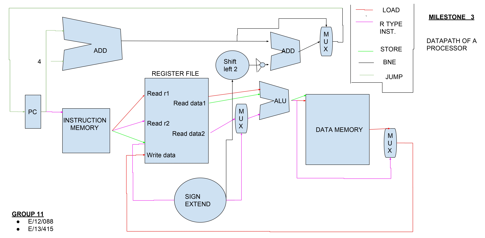

# 🚀 16-bit CISC-V Processor in Verilog

This project implements a 16-bit CISC-V processor datapath using Verilog. It includes modules such as ALU, Control Unit, Instruction Memory, Data Memory, Register File, and test benches to validate functionality. The processor performs basic arithmetic, memory operations, and control flow (branching, jumping).

## 🧰 Processor Architecture
<p align="center">  </p>

## 🧠 Modules Description

### Main Components
- **ALU.v**: Performs arithmetic and logical operations such as addition, subtraction, AND, OR, etc. Controlled by `ALUOp`.
- **CU.v (Control Unit)**: Generates control signals based on opcode to manage the datapath.
- **Datapath.v**: Integrates all modules and describes the flow of data through the 16-bit processor.
- **InstructionMemory.v**: Holds the instruction set to be executed by the CISC-V processor.
- **DataMemory.v**: Stores and retrieves data during `load` and `store` operations.
- **RegisterFile.v**: Contains general-purpose registers. Supports reading two registers and writing one register.

### Supporting Components
- **signExtend.v**: Extends 8-bit immediate values to 16-bit signed values for ALU input.
- **ADDER.v**: Performs 16-bit addition for PC updates and branch calculations.
- **mux_2X1 / mux_2X1Addr**: 2-to-1 multiplexers used for selecting between data and address sources.

## 🧪 Test Benches

- **ALUTEST.v**: Tests ALU operations for various opcodes.
- **DatapathTEST.v**: Simulates instruction execution through the full CISC-V datapath and validates correct behavior of components.

## ▶️ How to Run

### 🛠 Requirements:
* Icarus Verilog (iverilog)
* GTKWave (for waveform viewing)

### 🔧 Compile and Run:

```bash
# Compile ALU test
iverilog -o alu_test Test_Benches/ALUTEST.v Modules/ALU.v
./alu_test
gtkwave dump.vcd  # if using GTKWave

# Compile Datapath test
iverilog -o datapath_test Test_Benches/DatapathTEST.v Modules/*.v
./datapath_test
gtkwave dump.vcd
```

## 📌 Features

* 16-bit architecture for compact implementation
* CISC-based instruction set with rich operations
* Modular design for easy testing and debugging
* Parameterized data widths for scalability
* Simulation-based validation using test benches

## 💡 Future Work

* Add support for more complex instructions
* Implement pipelining stages
* Hazard detection and forwarding
* UART interface for I/O
* Memory-mapped peripherals

